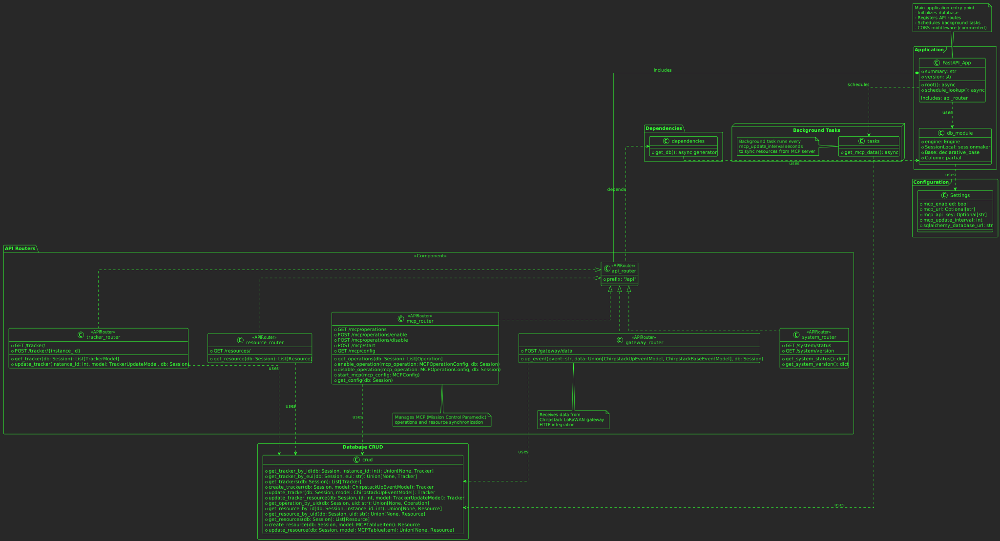

# Program Structure

> **For Contributors**: This document provides a quick overview of the tracking server architecture with embedded UML diagrams showing the system structure and workflows.

## Overview

The tracking server is a FastAPI-based backend application that receives GPS tracker data from Chirpstack LoRaWAN gateways and optionally integrates with an MCP (Mission Control Paramedic) server for resource management.

**Quick Start for Contributors:**
- Main application entry: `tracking/__init__.py`
- API endpoints: `tracking/api/`
- Database models: `tracking/db/models.py`
- CRUD operations: `tracking/db/crud.py`

## Architecture

### Component Overview



### Core Components

**FastAPI Application** (`tracking/__init__.py`)
- Main application entry point
- Initializes the database on startup
- Registers API routers
- Schedules background tasks for MCP synchronization

**Database Layer** (`tracking/db/`)
- SQLAlchemy ORM models (Tracker, Operation, Resource)
- CRUD operations for database access
- Session management and connection pooling

**API Routers** (`tracking/api/`)
- **gateway**: Receives Chirpstack LoRaWAN data via HTTP integration
- **tracker**: List and update trackers
- **resources**: Query available MCP resources
- **mcp**: Configure MCP integration and manage operations
- **system**: System status and version information

**Models** (`tracking/models.py`)
- Pydantic models for request/response validation
- Chirpstack payload models for LoRaWAN data
- MCP integration models


**Background Tasks** (`tracking/tasks.py`)
- Periodically syncs resources from MCP server
- Runs at configurable intervals using the scheduler utility

### Data Flow

#### 1. Tracker Data Ingestion
Chirpstack gateway posts LoRaWAN data to `/api/gateway/data` → creates or updates tracker records with battery level and GPS coordinates


#### 2. Frontend Queries
UI requests tracker list via `/api/tracker/` → returns all trackers with optional resource assignments


#### 3. Resource Assignment
Frontend assigns MCP resources to trackers → ensures unique one-to-one mapping


#### 4. MCP Integration
Background task fetches resources from MCP server → stores/updates in local database

.svg)

#### 5. MCP Configuration
Frontend configures MCP connection and enables operations


### Key Patterns

- **Dependency Injection**: `get_db()` provides database sessions to route handlers, ensuring proper connection lifecycle management
- **Repository Pattern**: CRUD functions abstract database operations from route handlers
- **Scheduled Tasks**: `repeat_every` decorator enables periodic background jobs without blocking the main event loop
- **Model Separation**: Database models (SQLAlchemy) are separate from API models (Pydantic) with conversion handled in CRUD layer

### Database Schema


- **Tracker**: Stores device EUI, name, battery level, GPS coordinates, last update timestamp, and optional resource reference
- **Operation**: Cached MCP operations with selection state
- **Resource**: MCP resources with status, linked one-to-one with trackers

### External Integrations

- **Chirpstack**: Receives uplink events from LoRaWAN network server via HTTP integration
- **MCP Server**: Optional integration for mission resource management, accessed via REST API

## Contributing Guide

When working on the tracking server:

1. **Adding API Endpoints**: Create route handlers in `tracking/api/`, use `Depends(get_db)` for database access
2. **Database Changes**: Modify `tracking/db/models.py` for schema changes, update CRUD functions in `tracking/db/crud.py`
3. **New Integrations**: Add Pydantic models in `tracking/models.py`, implement business logic in appropriate modules
4. **Background Tasks**: Use the `@repeat_every()` decorator from `tracking/utils/scheduling.py` for scheduled jobs

**Code Organization Pattern:**
```
API Router → CRUD Function → Database Model
     ↓
Pydantic Model (validation) → SQLAlchemy Model (persistence)
```

See the class diagram for the complete dependency structure and type signatures of all functions.
